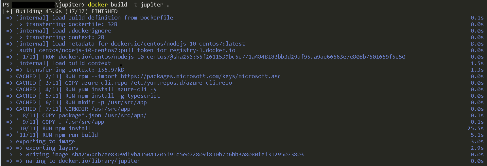
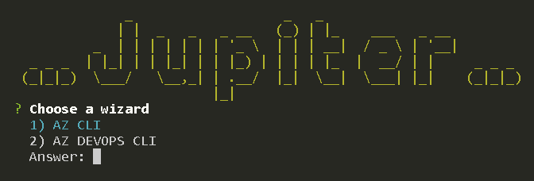
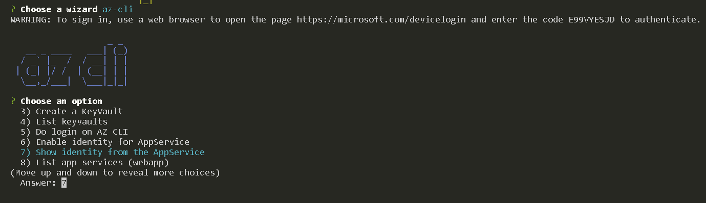

<p>

<center>


</center>

<h3 align="center">
  Empower yourself with safety and speed! 🚀
</h3>

<br>


## Content

- [Motivation](#motivation)
- [Technologies](#technologies)
- [Authors and Contributors](#authors-and-contributors)
- [How to use](#how-to-use)
- [How it works](#how-it-works)
    - [Dockerfile](#dockerfile)
    - [Jupiter](#jupiter)
    - [Operations of a Wizard](#operations-of-a-wizard)
    - [Operation Execution](#operation-execution)
- [Next steps](#next-steps)


## Motivation

To help squads improve resource management in cloud environments AND more.


## Technologies

- nodejs
- typescript
- docker


## Authors and Contributors

* **Raphael Wanderley**


## How to use

After clone the repository, enter on your `jupiter` root path and follow the steps:

`BUILD`

```
docker build -t jupiter . 
```




After build the docker image, execute the follow command:

`RUN`

```
docker run -it jupiter
```

**If you want to improve `jupiter` and test them, you will need to follow the `build` and `run` steps again. Otherwise just `run` it.**

#### LOCAL EXECUTION

**In case you want to develop more fast, you need to:**

- install in your machine the target wizard (e.g `az-cli`)
- execute `npm install`
- execute `npm run ts-node`


## How it works

### Dockerfile

The image is based on `centos` with `nodejs` installed. The image pack the `az cli` inside of it and provides a unique image.


### Jupiter

When jupiter is startup, a list of wizard options will be showed.




To do this, you need to create the `your_file_with_-wizard-index.ts` file following the below nomenclature:


> `app > wizards > az-cli > az-cli-wizard-index.ts`


### Operations of a Wizard

When a wizard (e.g `az-cli`) is executed, a list of operations will be showed.





To do this, you need to create the `your_file_with_-operation-index.ts` file following the below nomenclature:


> `app > wizards > az-cli > operations > az-login > az-cli-operation-index.ts`


### Operation Execution

By convention, create the `your_operation_execution_-command.ts` file following the below nomenclature:

> `app > wizards > az-cli > operations > az-login > az-login-command.ts`


In this example, the file will be execute de `az cli` *login* operation.


## Next steps

- [x] Improve readme
- [x] Improve docker build/run
- [ ] Use `alpine` image instead `centos/nodejs-10-centos7`
- [ ] Menu repeatable
- [ ] Refactoring operations executions
- [ ] Refactoring clean code
- [ ] Multi language
